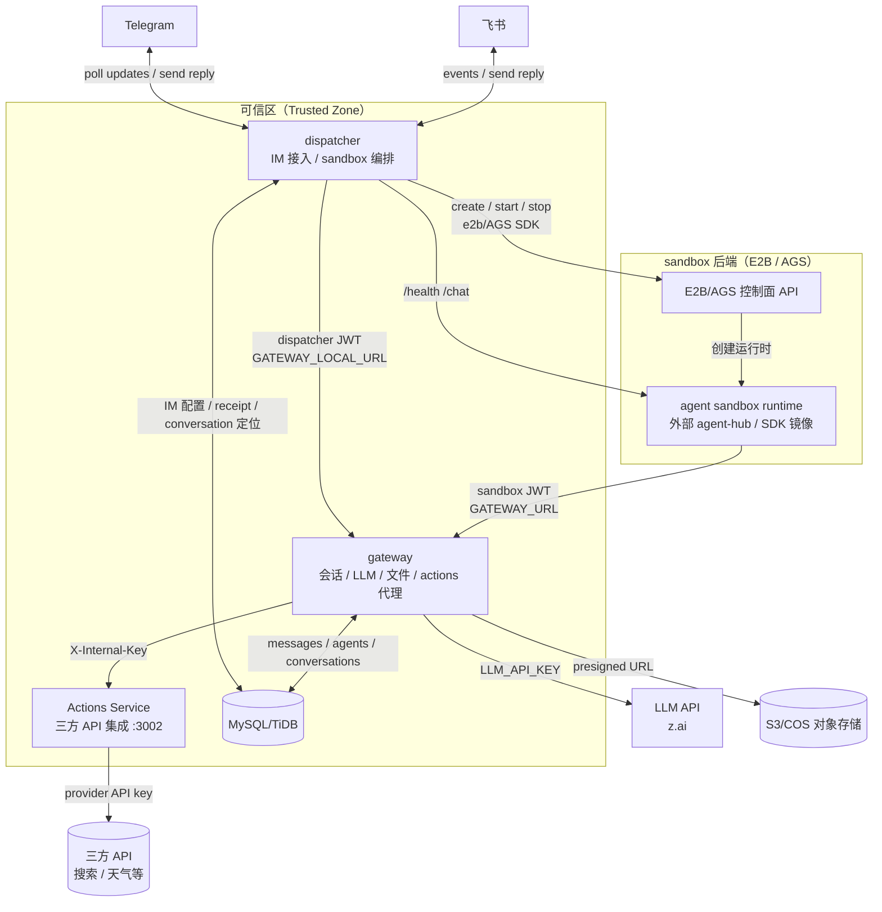

# Agent Runtime 架构

> 本文是 z-mono 的顶层架构地图，说明领域结构、服务边界和关键设计决策。更深入的设计原则见 [docs/design-docs/core-beliefs.md](./docs/design-docs/core-beliefs.md)。

<!-- DOC-GARDENING-CHANGE: 2026-04-17
  - Added users table to Key tables list
  - Fixed database reference: PostgreSQL → MySQL (matches schema.prisma provider)
  - Updated im_configs description: "bot token encrypted" → "credentials encrypted" (matches multi-provider design)
  - Clarified persistent file storage status: gateway routes implemented, sandbox daemon not yet implemented
-->

## 系统拓扑

## 服务边界

### gateway（`packages/gateway`）

**定位：** 可信后端入口，负责 sandbox 可访问的状态、LLM、文件和 Actions 代理能力。

主要能力：

- `POST /gateway/messages/load` — 读取指定会话的历史消息
- `POST /gateway/messages/append` — 追加消息，并通过 `expected_last_message_id` 做乐观并发控制
- `POST /gateway/llm` — 代理到上游 LLM API（当前默认 z.ai `glm-5.1`）
- `POST /gateway/storage/presign` — 生成受 agent/conversation 作用域约束的 S3 预签名 URL
- `POST /gateway/storage/list` — 列出 agent shared 或 conversation 前缀下的文件
- `GET /gateway/actions/list` / `POST /gateway/actions/invoke` — 将 sandbox 的工具调用代理到 Actions Service
- `GET /health` — 健康检查

**为什么 gateway 统一承载这些能力：** sandbox 运行在云端且不可信，不能接触数据库、LLM Key、对象存储密钥或三方 API Key。gateway 是可信区内的统一鉴权和作用域检查点。

### dispatcher（`packages/dispatcher`）

**定位：** IM 接入层和 sandbox 生命周期编排层。

主要能力：

- 监听已启用的 IM 配置（Telegram long-polling；飞书事件/长连接）
- 将各平台消息规范化为统一的 `NormalizedMessage`
- 通过 `im_message_receipts` 表做消息抢占、去重和 lease 管理
- 按请求创建 sandbox，等待 `/health`，调用 `/chat`，完成后销毁 sandbox
- 在调用 sandbox 前，把用户消息通过 gateway 写入历史
- sandbox 回复后，把结果发送回 IM，并标记 receipt 完成
- 维护本地 `lastMessageId` 缓存，辅助 gateway 消息写入的乐观并发控制

**为什么 dispatcher 管理 sandbox 生命周期：** sandbox 生命周期与 IM 消息处理、会话定位和用户回复强相关，这些都属于 dispatcher 的职责。gateway 不负责启动或回收 sandbox。

### Agent sandbox runtime

**定位：** 在隔离环境中运行不可信 agent 逻辑，并只通过 gateway 访问平台能力。

约束：

- agent runtime 代码不在本仓库维护，当前主要来自外部 `agent-sub` 项目或基于 `agent-sdk` 的镜像
- runtime 应遵循 agent SDK/harness 约定
- 收到 `POST /chat` 后：从 gateway 读取历史 → 通过 gateway 调 LLM → 追加 assistant 回复 → 返回文本
- 不持有平台密钥；启动时只接收 `SESSION_TOKEN` 和 `SESSION_ID`
- `SESSION_TOKEN` 是 `caller: 'sandbox'` 的 JWT，并被限制在单个 conversation 范围内

### Actions Service（`packages/actions`）

**定位：** 可信区内的三方 API 集成服务，统一持有三方 API Key，并只接受 gateway 的内部调用。

主要能力：

- `GET /actions/list` — 返回可用 action 及参数 schema
- `POST /actions/invoke` — 执行指定 action，例如网页搜索、天气查询

**鉴权：** gateway 调用 Actions Service 时必须携带共享密钥 `X-Internal-Key`。Actions Service 不对 sandbox 或公网直接开放。

**为什么独立为服务：** 三方 API 集成会持续增长。把它们放进 Actions Service 可以避免 gateway 膨胀，也能把三方 API Key 与 gateway 自身密钥隔离。新增、更新或轮换三方集成时，不需要修改 sandbox 代码，也尽量不触碰 gateway。

## 数据库模型

完整 schema 见 [docs/generated/db-schema.md](./docs/generated/db-schema.md)。

关键表：

| 表 | 作用 |
|----|------|
| `users` | 平台用户；MVP 阶段尚未完整接入 |
| `agents` | agent 定义，包括 sandbox template、端口和超时配置 |
| `im_configs` | agent 的 IM 渠道配置，凭证加密存储 |
| `conversations` | 每个 `(channel_key, external_chat_id, thread)` 对应一条会话 |
| `messages` | 完整对话历史，包含 role、content_json、source |
| `im_message_receipts` | IM 消息去重、处理状态、lease 和恢复依据 |

## 鉴权模型

所有 gateway 非健康检查请求都必须携带由 `JWT_SECRET` 签发的 JWT。

| 调用方 | `caller` claim | Token TTL | `/messages/append` 允许的 source |
|--------|----------------|-----------|-----------------------------------|
| dispatcher | `dispatcher` | 60 秒 | `im` |
| sandbox | `sandbox` | 24 小时 | `sandbox` |

**为什么区分 caller：** 如果 sandbox 被攻破，它也不能伪造 `im` 来源消息、冒充用户写入历史。gateway 会根据 JWT 的 `caller` claim 在服务端校验 message `source`。

## 持久化文件存储

gateway 已提供 `/gateway/storage/presign` 和 `/gateway/storage/list`，通过 S3 兼容对象存储实现文件上传、下载和列表能力。所有路径都受 agent/conversation 作用域限制。

规划中的存储布局：

- `agents/{agent_id}/shared/` — agent 级共享文件
- `agents/{agent_id}/conversations/{conv_id}/` — conversation 级文件

agent SDK 已包含 file-sync 支持；具体 sandbox runtime 需要在启动时启用同步逻辑。完整设计见 `docs/product-specs/sandbox-persistent-storage.md`。

## 消息历史的乐观并发控制

`/gateway/messages/append` 要求调用方提供 `expected_last_message_id`。如果数据库中的实际会话尾部不一致，gateway 返回 `409 stale_write`。

这样可以避免 dispatcher 和 sandbox 并发写入时破坏消息顺序。dispatcher 会为每个 conversation 维护内存态 `lastMessageId` 缓存，并在 sandbox 回复后异步同步。

## 不可跨越的边界

- sandbox → MySQL/TiDB：**禁止**。所有数据库访问必须通过 gateway API。
- dispatcher → LLM：**禁止**。所有 LLM 调用必须通过 gateway。
- gateway → e2b/AGS SDK：**禁止**。sandbox 生命周期由 dispatcher 管理。
- sandbox → Telegram/飞书：**禁止**。所有 IM 回复必须由 dispatcher 发送。
- sandbox → Actions Service：**禁止**。sandbox 只能访问 gateway；Actions Service 对 sandbox 不可见。
- Actions Service → sandbox：**禁止**。
- gateway → 三方 API：**原则上不做**。三方集成统一放在 Actions Service。

## 当前限制（MVP 范围）

- 暂无 dashboard / Web UI
- dispatcher 已支持 active `im_configs` 的 Telegram 和飞书，但多实例高可用仍需要完善 stale `im_message_receipts` lease 的恢复循环
- 当前每次请求都会创建新 sandbox，生命周期简单但有冷启动延迟
- `lastMessageId` 缓存在 dispatcher 内存中；dispatcher 重启后会从 gateway 历史中懒恢复
