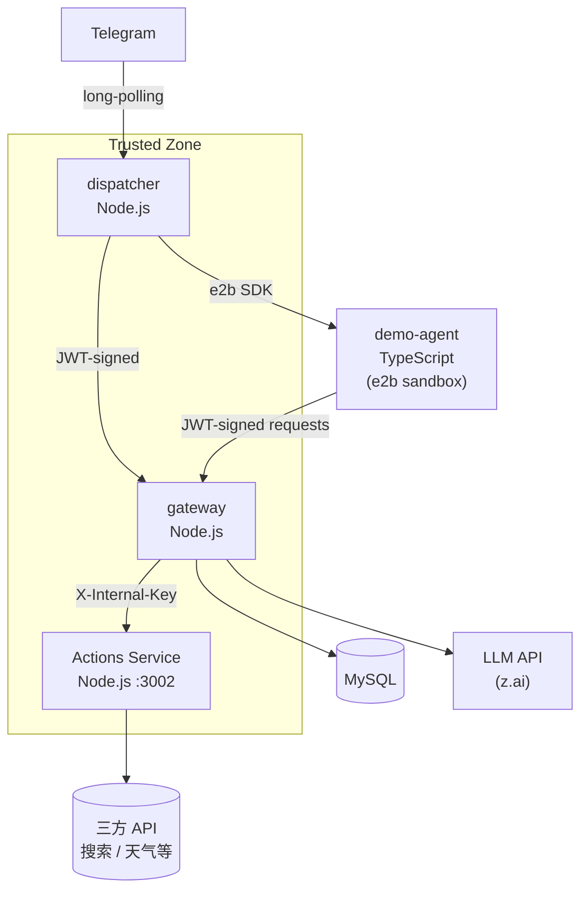

# Architecture

> Top-level map of z-mono's domain structure, service boundaries, and key design decisions. For deeper design rationale see [docs/design-docs/core-beliefs.md](./docs/design-docs/core-beliefs.md).

<!-- DOC-GARDENING-CHANGE: 2026-04-29
  - Updated demo-agent description: Python/Flask → TypeScript/Express with agent-sdk
-->
<!-- DOC-GARDENING-CHANGE: 2026-04-17
  - Added users table to Key tables list
  - Fixed database reference: PostgreSQL → MySQL (matches schema.prisma provider)
  - Updated im_configs description: "bot token encrypted" → "credentials encrypted" (matches multi-provider design)
  - Clarified persistent file storage status: gateway routes implemented, sandbox daemon not yet implemented
-->

## System topology

## Services

### gateway (`packages/gateway`)

**Responsibility:** The single trusted backend. Owns all state and external access.

- `POST /gateway/messages/load` — load conversation history for a conversation
- `POST /gateway/messages/append` — append messages (with optimistic concurrency via `expected_last_message_id`)
- `POST /gateway/llm` — proxy to upstream LLM API (currently glm-5.1 at z.ai)
- `POST /gateway/storage/presign` — generate presigned S3 URLs for file upload/download (scoped to agent/conversation)
- `POST /gateway/storage/list` — list files under agent's shared or conversation prefix
- `GET /health`

**Why gateway owns everything:** Sandboxes run in the cloud (e2b) and are untrusted. All storage and LLM keys must remain in the trusted zone. Gateway is the single chokepoint that enforces auth and scoping.

### dispatcher (`packages/dispatcher`)

**Responsibility:** IM channel integration and sandbox lifecycle.

- Polls Telegram for new messages (long-polling)
- Normalizes messages into a canonical `NormalizedMessage` shape
- Deduplicates via `inbound_jobs` table (exactly-once processing guarantee)
- Manages the sandbox map: one sandbox per `conversation_id`, created on demand, destroyed after idle timeout
- Appends user messages to gateway before dispatching to sandbox
- After sandbox replies: sends Telegram message, marks job done, fire-and-forget syncs `lastMessageId` cache

**Why dispatcher manages sandbox lifecycle (not gateway):** Sandbox lifecycle is tied to IM sessions and conversation state, which dispatcher owns. Gateway is stateless between requests.

### demo-agent (`packages/demo-agent`)

**Responsibility:** Reference agent runtime, packaged as an e2b template.

- Built with `@alexlikevibe/agent-sdk` (TypeScript/Express)
- Express app listening on port 8080
- On `POST /chat` (handled by SDK): loads history from gateway → calls LLM via gateway → appends assistant reply → returns text
- Holds no credentials; receives `SESSION_TOKEN` (JWT) and `SESSION_ID` via env vars at sandbox start
- `SESSION_TOKEN` has `caller: 'sandbox'` claim, scoped to one conversation

**Why TypeScript/Express:** The agent-sdk provides a complete harness for building agents. Demo-agent uses the SDK's `createAgent()` API and is a template for third-party agent developers.

### Actions Service (`packages/actions`)

**Responsibility:** Unified gateway for third-party API integrations. Holds all external API keys; exposes internal-only endpoints for gateway to invoke tools.

- `GET /actions/list` — return the list of available actions and their parameter schemas
- `POST /actions/invoke` — invoke a named action (e.g. web search, weather lookup) and return the result

**Auth:** All requests from gateway must carry the `X-Internal-Key` shared secret. The service is not reachable from sandboxes or the public internet.

**Why a dedicated service:** Keeps third-party API keys out of gateway (single-responsibility) and out of sandboxes (security). Centralizing integrations here makes it easy to add, update, or rotate keys without touching gateway or agent code.

## Database schema

See [docs/generated/db-schema.md](./docs/generated/db-schema.md) for the full annotated schema.

Key tables:

| Table | Purpose |
|-------|---------|
| `users` | Platform users (not yet wired up in MVP) |
| `agents` | Agent definitions (e2b template, port, idle timeout) |
| `im_configs` | IM channel config per agent (credentials encrypted at rest) |
| `conversations` | One row per (channel_key, external_chat_id, thread) |
| `messages` | Full conversation history (role, content_json, source) |
| `inbound_jobs` | Dedup + at-least-once processing with lease-based recovery |

## Auth model

All gateway requests require a JWT signed with `JWT_SECRET`.

| Caller | `caller` claim | Token TTL | Allowed sources in `/messages/append` |
|--------|----------------|-----------|--------------------------------------|
| dispatcher | `dispatcher` | 60s | `im` only |
| sandbox | `sandbox` | 24h | `sandbox` only |

**Why two caller types:** Prevents a compromised sandbox from injecting `im`-sourced messages and impersonating users. The `source` field on messages is enforced server-side against the `caller` claim — the sandbox cannot forge user messages.

## Persistent file storage

Gateway provides presigned S3 URLs via `/gateway/storage/presign` and `/gateway/storage/list` routes, scoped to the requesting agent/conversation. The sandbox side file sync daemon is not yet implemented.

Planned storage layout: `agents/{agent_id}/shared/` (cross-conversation) and `agents/{agent_id}/conversations/{conv_id}/` (conversation-scoped). See `docs/product-specs/sandbox-persistent-storage.md` for full design.

## Optimistic concurrency on message history

`/messages/append` requires `expected_last_message_id`. If the actual head differs, it returns `409 stale_write`. This prevents interleaved writes from dispatcher and sandbox corrupting message order.

Dispatcher maintains an in-memory `lastMessageId` cache per conversation, updated after each append and lazily synced after sandbox replies.

## Key boundaries (do not cross)

- Sandbox → PostgreSQL directly: **never**. All DB access goes through gateway API.
- Dispatcher → LLM directly: **never**. All LLM calls go through gateway.
- Gateway → e2b SDK: **never**. Sandbox lifecycle is dispatcher's concern.
- Sandbox → Telegram directly: **never**. All IM replies go through dispatcher.
- Sandbox → Actions Service directly: **never**. Sandboxes only communicate with gateway; Actions Service is not visible to sandboxes.
- Actions Service → sandbox directly: **never**.
- Gateway → third-party APIs directly: **should not happen**. All third-party integrations are implemented inside Actions Service.

## Current limitations (MVP scope)

- Single active agent at a time (dispatcher loads one `agents` row)
- Single dispatcher instance (no horizontal scaling; `inbound_jobs` lease recovery exists but untested at scale)
- Sandbox map is in-memory (lost on dispatcher restart; next message recreates sandbox)
- No dashboard / web UI yet
- Telegram and Feishu supported (`im_configs.provider` IN ('telegram', 'feishu'))
