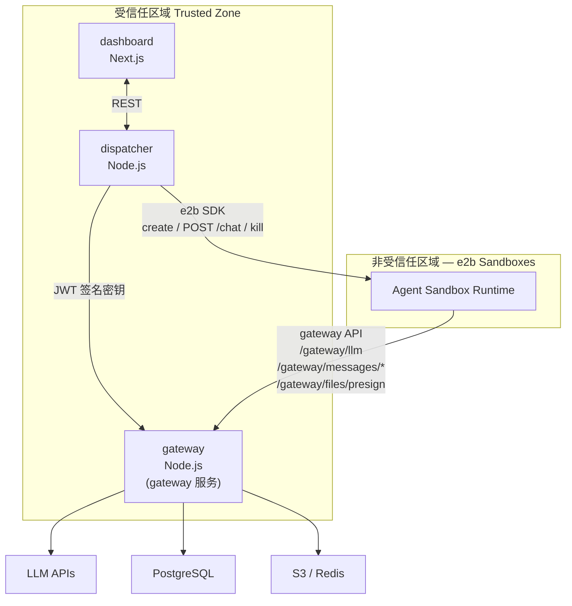
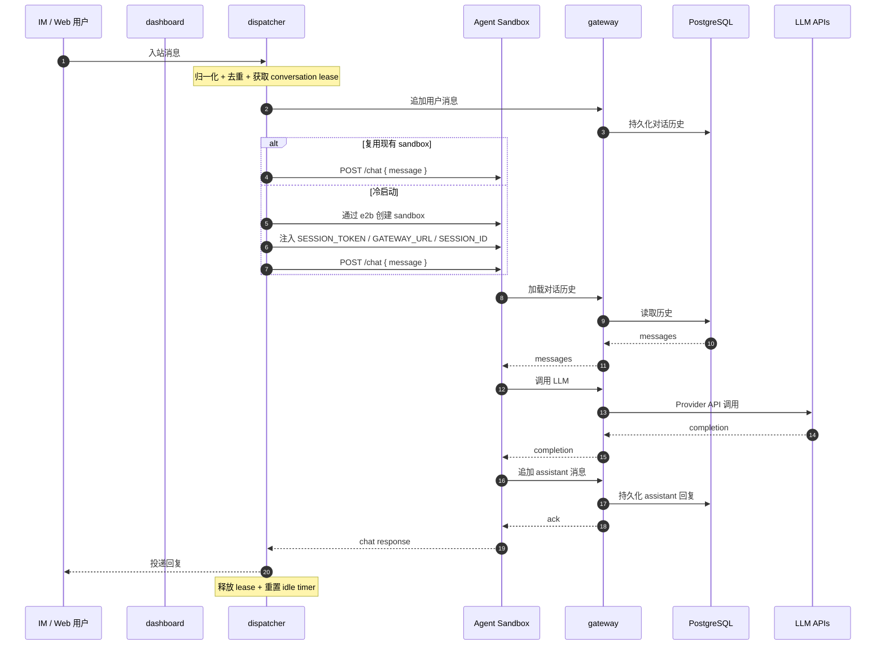

# Agent as a Service — 设计文档

**日期：** 2026-03-30  
**状态：** 草稿  
**参考：** [Browser Use — How We Built Secure, Scalable Agent Sandbox Infrastructure](https://x.com/larsencc/status/2027225210412470668)

---

## 1. 概述

Agent as a Service（AaaS）是一个多租户 SaaS 平台，让用户可以部署可通过 IM 渠道（Telegram、飞书、Slack 等）访问的 AI agent。用户通过 Web dashboard 创建 agent 实例、配置其 IM 凭证，平台负责其余工作——拉起沙箱化的 agent 运行时、路由消息，并持久化对话历史。

该平台被设计为**开放**的：第三方开发者可以构建并发布自己的 agent 类型到 marketplace。用户浏览 marketplace、选择某种 agent 类型、配置其 IM 渠道后，agent 即可上线——无需了解底层基础设施。

---

## 2. 目标

- 用户无需编写代码，即可通过 Web dashboard 创建并配置 agent
- agent 可直接通过 IM 渠道访问（Telegram、Slack、飞书、企业微信等）
- agent 代码运行在隔离沙箱中，无法访问平台密钥
- 对话历史可在沙箱重启后持续保留
- 第三方开发者可在不修改平台代码的前提下发布新的 agent 类型
- 对于符合平台 runtime contract 的 agent 类型，其接入只需要元数据与配置变更——无需修改 dispatcher 代码

## 3. 非目标

- 构建一个通用的代码执行平台
- 支持面向 IM 的实时流式响应（IM 平台各自处理此问题）
- 自建构建基础设施（至少在 v1 阶段仍依赖外部 CI）
- 多区域部署（v1 仅单区域）

---

## 4. 架构总览

该平台采用一种以 **gateway** 为中心的隔离架构：完整的 agent 在一个隔离沙箱（micro-VM）中运行，而所有外部访问（LLM 调用、存储、消息历史）都通过一个受信任的 gateway 进行中转。沙箱本身不持有任何凭证。

### 4.1 系统拓扑



### 4.2 消息流



## 5. 服务设计

| 服务           | 运行时          | 角色                                                |
| -------------- | --------------- | --------------------------------------------------- |
| **dashboard**  | Next.js         | 用户管理、agent 配置、marketplace UI |
| **dispatcher** | Node.js（常驻） | IM 连接、消息分发、sandbox 生命周期管理 |
| **gateway**    | Node.js（常驻） | 代理沙箱的所有外部访问 |

### 5.1 dashboard

一个 Next.js 应用，作为面向用户的管理界面与 BFF。

**职责：**

- 用户注册、登录、账户与团队管理
- agent 创建：从 marketplace 中选择 agent 类型并配置参数
- IM 渠道配置：通过 UI 收集 bot token 及相关渠道设置
- 查看对话历史、每个 agent 的使用指标
- Web 测试聊天界面：将其抽象为平台内置的 Web 渠道，使其复用与 IM 渠道相同的对话处理流程
- Agent marketplace：浏览、安装、评分与评论已发布的 agent 类型
- 开发者门户：提交 agent、查看构建状态、查看收益

**数据访问：** 直接读写大多数应用元数据到 PostgreSQL（users、agents、im_configs、agent_types 表）。明文 IM 凭证**不会**由 dashboard 直接写库；它们会通过受认证的内部 API 提交给 dispatcher，由 dispatcher 加密后再持久化。

**交互：**
- 当新的 agent 上线或停用时，通过 REST 通知 dispatcher
- 当用户创建或更新 channel binding 时，将明文 IM 凭证发送给 dispatcher 进行加密与存储
- 调用 dispatcher 上的 `POST /agents/:id/chat` 作为 Web 测试聊天接口，该接口会被归一化到与 IM 流量相同的 conversation/history 模型中

---

### 5.2 dispatcher

一个常驻的 Node.js 进程，是平台运行层面的核心。它负责 IM 连接、入站事件归一化，以及 sandbox 生命周期管理。

在 v1 中，dispatcher 同时承担 IM ingress 与 sandbox orchestration 两类职责，以减少跨服务协调复杂度。实现上建议在同一个服务内部拆分为三个清晰模块：

- `im-ingress`：负责维护 Telegram long-polling、Slack WebSocket、飞书 / 企业微信 webhook 等平台接入，接收并校验原始平台事件
- `conversation-router`：负责将平台事件归一化、定位或创建 `conversation_id`、执行去重，并将消息路由到按 conversation 分区的串行处理队列
- `sandbox-orchestrator`：负责创建 / 复用 / 销毁 e2b sandbox，调用 agent 的 `/chat` 接口，并处理超时、重试与空闲回收

这种划分意味着：**逻辑上分层，部署上不分家**。后续当连接规模、故障隔离要求或扩容模式出现明显分化时，可将这些模块进一步演进为独立服务。

**职责：**

**IM 连接**
- 按平台类型维护接入资源，单位取决于平台协议：
  - Telegram：为每个激活的 bot binding 维持一条 HTTP long-polling 连接（`getUpdates`，30 秒超时，随后立即重新轮询）；同一个 bot 所在的多个 chat / group 共享这条连接
  - Slack：为每个激活的 app / bot binding 维持一条 Socket Mode WebSocket 连接
  - 飞书 / 企业微信：接收入站 webhook POST（无持久连接）
- 当新的 agent 激活时（由 dashboard 通知），建立对应的 IM 接入资源
- 当 agent 停用、binding 被解绑、凭证变更或认证持续失败时，释放并重建或移除相应资源
- IM 连接按 binding 生命周期管理，而不是按单个 conversation 管理；单个 conversation 空闲或 sandbox 被销毁时，不会主动释放对应的 IM 连接
- 在接受 webhook 流量前，校验平台相关的 webhook 签名

**消息分发**
- 将入站事件归一化为统一结构：`{ channel_key, external_chat_id, external_thread_key, external_message_id, author, content }`
- `channel_key` 是消息来源的稳定内部标识，例如 IM 流量使用 `im:<im_config_id>`，dashboard 测试聊天使用 `web:<agent_id>:test`
- 将 `channel_key + external_chat_id + external_thread_key → conversation_id`
- 在处理前，按 `(channel_key, external_message_id)` 对入站事件去重
- 将已接受的消息路由到**按 conversation 分区的串行处理队列**。v1 由 PostgreSQL 的 `im_message_receipts` + lease 机制实现；在更高吞吐场景下，可演进为基于 Redis 的共享队列实现
- 确保同一 conversation 内的消息始终串行处理，避免多个 sandbox 实例并发读写同一历史而破坏一致性

**归一化字段说明**

- `channel_key`：消息进入平台时所经过的稳定接入标识，用于区分“这条消息是从哪个 bot / app / web 测试入口进来的”，例如 `im:telegram_binding_123` 或 `web:agent_789:test`
- `external_chat_id`：平台侧的会话容器标识，例如 Telegram 群 ID、Slack channel ID、飞书 chat ID，或 Web 测试聊天的 session ID
- `external_thread_key`：平台侧的 thread / topic 标识；如果平台没有 thread 概念，则统一使用空字符串 `""`
- `external_message_id`：平台侧为该消息分配的唯一标识，用于幂等、去重和故障恢复
- `author`：消息发送者信息，至少包含平台用户 ID 与展示名；必要时还可以扩展 bot 标记、角色等字段
- `content`：归一化后的消息内容。v1 可先支持文本结构，后续再扩展图片、文件、mention、富文本等类型

**归一化示例**

Telegram 群消息原始事件可能类似：

```json
{
  "update_id": 987654321,
  "message": {
    "message_id": 42,
    "from": {
      "id": 12345,
      "first_name": "Alice"
    },
    "chat": {
      "id": -100888999,
      "title": "AI 群",
      "type": "supergroup"
    },
    "text": "帮我总结一下今天的讨论"
  }
}
```

归一化后：

```json
{
  "channel_key": "im:telegram_binding_123",
  "external_chat_id": "-100888999",
  "external_thread_key": "",
  "external_message_id": "42",
  "author": {
    "external_user_id": "12345",
    "display_name": "Alice"
  },
  "content": {
    "type": "text",
    "text": "帮我总结一下今天的讨论"
  }
}
```

Slack thread 回复原始事件可能类似：

```json
{
  "type": "message",
  "user": "U123ABC",
  "text": "继续展开第二点",
  "ts": "1710000000.100200",
  "thread_ts": "1710000000.000100",
  "channel": "C999XYZ"
}
```

归一化后：

```json
{
  "channel_key": "im:slack_binding_456",
  "external_chat_id": "C999XYZ",
  "external_thread_key": "1710000000.000100",
  "external_message_id": "1710000000.100200",
  "author": {
    "external_user_id": "U123ABC",
    "display_name": null
  },
  "content": {
    "type": "text",
    "text": "继续展开第二点"
  }
}
```

Dashboard Web 测试聊天原始请求可能类似：

```json
{
  "agent_id": "agent_789",
  "session_id": "web_test_001",
  "owner_id": "user_123",
  "message_id": "msg_001",
  "text": "你好，帮我自我介绍一下"
}
```

归一化后：

```json
{
  "channel_key": "web:agent_789:test",
  "external_chat_id": "web_test_001",
  "external_thread_key": "",
  "external_message_id": "msg_001",
  "author": {
    "external_user_id": "user_123",
    "display_name": "dashboard user"
  },
  "content": {
    "type": "text",
    "text": "你好，帮我自我介绍一下"
  }
}
```

**Sandbox 生命周期**
- 从 DB 中 `agent_types` 表读取 `template_id`、`port`、`idle_timeout_ms`
- 通过 e2b SDK 使用该 agent 的模板创建 sandbox
- 注入且仅注入三个环境变量（见 §7 Security Model）
- 轮询 `GET /health` 端点，直到返回 200（readiness 检查是 runtime contract 的固定约定，所有 agent 统一遵守）
- 在调用 sandbox 之前，先通过 gateway 将归一化后的**用户消息** append 到 canonical history
- 转发 `POST /chat { message }` 到 sandbox
- 等待响应，然后将其返回给 IM 用户
- 在最后一条消息后继续保活 `idle_timeout_ms`；超时后销毁
- 对于符合 runtime contract 的 agent 类型，dispatcher 的行为完全是数据驱动的，无需代码改动

**扩展说明：** 大规模下，可以并行运行多个 dispatcher 实例。每个实例负责一部分 channel binding 或 webhook 流量分片。对于需要持久连接的平台（如 Telegram、Slack），实例间通过数据库中的 binding ownership lease 协调哪个实例拥有对应的 bot / app binding。基于 webhook 的平台（如飞书）天然是无状态的，可通过负载均衡分发。发版、重启或缩容时，旧实例应先停止接收新的 bindings 与重连任务，处理完手头中的消息后释放 lease 与连接；新实例再获取 lease 并重建对应连接，从而完成平滑接管。

---

### 5.3 gateway

一个 Node.js 进程，作为 sandbox 与外部世界之间的唯一 gateway，也是平台的统一外部访问代理。它负责执行安全边界。

**职责：**
- 对每个来自 sandbox 的请求校验 `SESSION_TOKEN`（JWT）
- 使用平台持有的 API key 代理 LLM 调用
- 作为对话历史的唯一持有者，从 PostgreSQL 加载并持久化对话消息
- 为文件 I/O 签发带时限、带路径作用域的 S3 presigned URL
- 按用户实施限流，并跟踪 LLM 使用量以用于计费

**Gateway API（暴露给 sandbox 的 API）：**

**通用请求头**

```http
Authorization: Bearer <SESSION_TOKEN>
Content-Type: application/json
```

**通用错误格式**

```json
{
  "error": {
    "code": "stale_write",
    "message": "expected_last_message_id does not match current history head",
    "retryable": false,
    "details": {}
  }
}
```

常见 `error.code` 包括：`unauthorized`、`token_expired`、`rate_limited`、`invalid_request`、`stale_write`、`not_found`、`provider_error`、`internal_error`。

**统一消息对象结构**

```json
{
  "id": "msg_123",
  "role": "user",
  "content": [
    { "type": "text", "text": "hello" }
  ],
  "source": "im",
  "external_message_id": "42",
  "metadata": {},
  "created_at": "2026-03-30T10:00:00Z"
}
```

其中：
- `role`：`user | assistant | system | tool`
- `source`：`im | web | sandbox | system`
- `content`：统一使用数组结构，便于后续扩展图片、文件、富文本等内容类型

#### `POST /gateway/llm`

Sandbox 通过此接口代理 LLM 调用。LLM API Key 仅存放在 gateway 的环境变量中，sandbox 不持有任何 LLM 凭证——这是平台的核心安全边界之一。Sandbox 负责构造完整的 `messages` 数组（包括 system prompt、历史消息、tool results 等），gateway 在校验 JWT 后透传给 LLM provider，并将 `usage` 记录用于计费。

**请求体示例：**

```json
{
  "model": "openai/gpt-5",
  "messages": [
    {
      "role": "system",
      "content": [
        { "type": "text", "text": "You are a helpful assistant." }
      ]
    },
    {
      "role": "user",
      "content": [
        { "type": "text", "text": "帮我总结今天的讨论" }
      ]
    }
  ],
  "tools": [
    {
      "name": "search_docs",
      "description": "Search docs",
      "input_schema": {
        "type": "object",
        "properties": {
          "query": { "type": "string" }
        },
        "required": ["query"]
      }
    }
  ],
  "tool_choice": "auto"
}
```

**字段说明：**
- `model`：要调用的模型名
- `messages`：发给模型的上下文消息
- `tools`：可选，本轮可用工具定义
- `tool_choice`：可选，可取 `auto`、`none`、`required`，或显式指定某个工具

**返回体示例（普通文本回复）：**

```json
{
  "provider": "openai",
  "model": "openai/gpt-5",
  "message": {
    "role": "assistant",
    "content": [
      { "type": "text", "text": "今天主要讨论了三点..." }
    ],
    "tool_calls": []
  },
  "finish_reason": "stop",
  "usage": {
    "input_tokens": 1200,
    "output_tokens": 180,
    "total_tokens": 1380
  },
  "request_id": "req_123"
}
```

**返回体示例（模型请求工具调用）：**

```json
{
  "provider": "openai",
  "model": "openai/gpt-5",
  "message": {
    "role": "assistant",
    "content": [],
    "tool_calls": [
      {
        "id": "call_1",
        "name": "search_docs",
        "arguments": {
          "query": "session manager"
        }
      }
    ]
  },
  "finish_reason": "tool_calls",
  "usage": {
    "input_tokens": 980,
    "output_tokens": 60,
    "total_tokens": 1040
  },
  "request_id": "req_124"
}
```

#### `POST /gateway/messages/load`

用于加载当前 conversation 的历史消息。

**请求体示例：**

```json
{
  "after_message_id": "msg_100"
}
```

**字段说明：**
- `after_message_id`：可选，只加载某条消息之后的增量历史；不传则返回完整历史

**返回体示例：**

```json
{
  "conversation_id": "conv_abc123",
  "messages": [
    {
      "id": "msg_101",
      "role": "user",
      "content": [
        { "type": "text", "text": "你好" }
      ],
      "source": "im",
      "external_message_id": "42",
      "metadata": {},
      "created_at": "2026-03-30T10:00:00Z"
    },
    {
      "id": "msg_102",
      "role": "assistant",
      "content": [
        { "type": "text", "text": "你好，我可以帮你做什么？" }
      ],
      "source": "sandbox",
      "external_message_id": null,
      "metadata": {},
      "created_at": "2026-03-30T10:00:03Z"
    }
  ],
  "last_message_id": "msg_102"
}
```

#### `POST /gateway/messages/append`

用于向 canonical history 追加消息。

**请求体示例：**

```json
{
  "expected_last_message_id": "msg_102",
  "messages": [
    {
      "role": "assistant",
      "content": [
        { "type": "text", "text": "这是新的回复" }
      ],
      "source": "sandbox",
      "external_message_id": null,
      "metadata": {
        "model": "openai/gpt-5"
      }
    }
  ]
}
```

**字段说明：**
- `expected_last_message_id`：**必填**，用于 optimistic concurrency control。传入调用方认为的当前历史末尾消息 ID；若期望历史为空（首条消息）则传 `null`。不传或与当前实际末尾不一致时，gateway 返回 `stale_write` 错误
- `messages`：要追加的消息数组，可一次 append 多条

**返回体示例：**

```json
{
  "conversation_id": "conv_abc123",
  "appended": [
    {
      "id": "msg_103",
      "role": "assistant",
      "created_at": "2026-03-30T10:00:05Z"
    }
  ],
  "last_message_id": "msg_103"
}
```

**冲突示例：**

```json
{
  "error": {
    "code": "stale_write",
    "message": "expected_last_message_id does not match current history head",
    "retryable": false,
    "details": {
      "expected_last_message_id": "msg_102",
      "actual_last_message_id": "msg_105"
    }
  }
}
```

#### `POST /gateway/files/presign`

用于申请文件读写的 presigned URL。

**请求体示例：**

```json
{
  "path": "notes/today-summary.md",
  "scope": "conversation",
  "operation": "write"
}
```

**字段说明：**
- `path`：相对路径，不能是绝对路径
- `scope`：v1 仅支持 `conversation`
- `operation`：`read` 或 `write`

**返回体示例（写入）：**

```json
{
  "scope": "conversation",
  "object_key": "agents/agent_xyz/conversations/conv_abc123/notes/today-summary.md",
  "operation": "write",
  "method": "PUT",
  "url": "https://s3.example.com/...",
  "headers": {
    "Content-Type": "application/octet-stream"
  },
  "expires_at": "2026-03-30T10:15:00Z"
}
```

**返回体示例（读取）：**

```json
{
  "scope": "conversation",
  "object_key": "agents/agent_xyz/conversations/conv_abc123/notes/today-summary.md",
  "operation": "read",
  "method": "GET",
  "url": "https://s3.example.com/...",
  "headers": {},
  "expires_at": "2026-03-30T10:15:00Z"
}
```

**OpenAPI 风格摘要**

```yaml
openapi: 3.1.0
info:
  title: Gateway API
  version: v1
components:
  securitySchemes:
    bearerAuth:
      type: http
      scheme: bearer
      bearerFormat: JWT
  schemas:
    ErrorResponse:
      type: object
      properties:
        error:
          type: object
          properties:
            code:
              type: string
            message:
              type: string
            retryable:
              type: boolean
            details:
              type: object
              additionalProperties: true
          required: [code, message, retryable, details]
      required: [error]
    ContentPart:
      type: object
      properties:
        type:
          type: string
          enum: [text]
        text:
          type: string
      required: [type, text]
    StoredMessage:
      type: object
      properties:
        id:
          type: string
        role:
          type: string
          enum: [user, assistant, system, tool]
        content:
          type: array
          items:
            $ref: '#/components/schemas/ContentPart'
        source:
          type: string
          enum: [im, web, sandbox, system]
        external_message_id:
          type: [string, 'null']
        metadata:
          type: object
          additionalProperties: true
        created_at:
          type: string
          format: date-time
      required: [role, content, source]
    LLMInputMessage:
      type: object
      properties:
        role:
          type: string
          enum: [user, assistant, system, tool]
        content:
          type: array
          items:
            $ref: '#/components/schemas/ContentPart'
      required: [role, content]
paths:
  /gateway/llm:
    post:
      security:
        - bearerAuth: []
      summary: Proxy an LLM request through gateway
      requestBody:
        required: true
        content:
          application/json:
            schema:
              type: object
              properties:
                model:
                  type: string
                messages:
                  type: array
                  items:
                    $ref: '#/components/schemas/LLMInputMessage'
                tools:
                  type: array
                  items:
                    type: object
                    additionalProperties: true
                tool_choice:
                  oneOf:
                    - type: string
                    - type: object
                      additionalProperties: true
              required: [model, messages]
      responses:
        '200':
          description: Successful LLM response
        '400':
          description: Invalid request
          content:
            application/json:
              schema:
                $ref: '#/components/schemas/ErrorResponse'
        '401':
          description: Unauthorized
          content:
            application/json:
              schema:
                $ref: '#/components/schemas/ErrorResponse'
        '429':
          description: Rate limited
          content:
            application/json:
              schema:
                $ref: '#/components/schemas/ErrorResponse'
        '502':
          description: Upstream provider error
          content:
            application/json:
              schema:
                $ref: '#/components/schemas/ErrorResponse'
  /gateway/messages/load:
    post:
      security:
        - bearerAuth: []
      summary: Load canonical conversation history
      requestBody:
        required: false
        content:
          application/json:
            schema:
              type: object
              properties:
                after_message_id:
                  type: string
      responses:
        '200':
          description: Conversation history
        '401':
          description: Unauthorized
          content:
            application/json:
              schema:
                $ref: '#/components/schemas/ErrorResponse'
  /gateway/messages/append:
    post:
      security:
        - bearerAuth: []
      summary: Append messages to canonical conversation history
      requestBody:
        required: true
        content:
          application/json:
            schema:
              type: object
              properties:
                expected_last_message_id:
                  type: [string, 'null']
                messages:
                  type: array
                  items:
                    $ref: '#/components/schemas/StoredMessage'
              required: [expected_last_message_id, messages]
      responses:
        '200':
          description: Append succeeded
        '401':
          description: Unauthorized
          content:
            application/json:
              schema:
                $ref: '#/components/schemas/ErrorResponse'
        '409':
          description: Optimistic concurrency conflict
          content:
            application/json:
              schema:
                $ref: '#/components/schemas/ErrorResponse'
  /gateway/files/presign:
    post:
      security:
        - bearerAuth: []
      summary: Create a presigned URL for file access
      requestBody:
        required: true
        content:
          application/json:
            schema:
              type: object
              properties:
                path:
                  type: string
                scope:
                  type: string
                  enum: [conversation]
                operation:
                  type: string
                  enum: [read, write]
              required: [path, scope, operation]
      responses:
        '200':
          description: Presigned URL created
        '400':
          description: Invalid request
          content:
            application/json:
              schema:
                $ref: '#/components/schemas/ErrorResponse'
        '401':
          description: Unauthorized
          content:
            application/json:
              schema:
                $ref: '#/components/schemas/ErrorResponse'
```

这个 OpenAPI 摘要主要用于统一字段命名、状态码与安全模型，便于后续将设计文档转成正式接口定义。真正落地时，可继续补充更严格的 schema（例如富文本内容、工具调用结构、usage 结构、presigned URL 返回结构等）。

**信任模型：**
- 在 v1 中，dispatcher 与 gateway 共享一个 JWT 签名密钥（配置层共享，而非通过 HTTP 交互）
- dispatcher 在创建 sandbox 时负责签发 JWT；gateway 独立完成验签
- JWT payload 包含 `conversation_id`、`agent_id`、`owner_id`、`exp` 与 `jti`
- JWT 会在 sandbox session 结束时过期；gateway 会拒绝过期 token
- v1 中 token revocation 为粗粒度：结束 sandbox session 并令 token 过期，即可阻止后续访问

---

### 5.4 Internal API（dashboard → dispatcher）

Dashboard 通过一组内部 REST API 与 dispatcher 交互。这些接口**不对外暴露**，仅在私有网络内使用。

#### 认证

所有请求需携带两个固定请求头：

```http
X-Internal-Api-Key: <shared key>
X-Operator-Id: user_123
Content-Type: application/json
```

- `X-Internal-Api-Key`：共享 API Key，存放在 dashboard 和 dispatcher 各自的环境变量中，不进数据库
- `X-Operator-Id`：发起该操作的平台用户 ID，由 dashboard 在验证用户 session 后填入；dispatcher 信任此断言（无需二次验证），并将其写入审计日志

#### 审计日志

Dispatcher 对所有 Internal API 请求记录审计日志，至少包含：

| 字段 | 说明 |
|---|---|
| `operator_id` | 来自 `X-Operator-Id` |
| `action` | 操作类型，如 `agent.activate`、`im_config.create` |
| `resource_id` | 操作目标的资源 ID |
| `result` | `success` \| `failure` |
| `error` | 失败时的错误信息 |
| `timestamp` | 操作时间 |

#### 通用错误格式

```json
{
  "error": {
    "code": "not_found",
    "message": "Agent not found"
  }
}
```

常见 `error.code`：`unauthorized`、`not_found`、`invalid_request`、`internal_error`。

---

#### `POST /internal/agents/:id/chat`

Web 测试聊天入口。Dispatcher 将其归一化为与 IM 流量相同的 conversation/history 模型（`channel_key` 为 `web:<agent_id>:test`），走相同的 sandbox 调度路径。

**请求体：**

```json
{
  "session_id": "web_test_001",
  "message_id": "msg_001",
  "text": "你好，帮我自我介绍一下"
}
```

**字段说明：**
- `session_id`：Web 测试会话 ID，对应 `external_chat_id`；同一 session 的消息归入同一 conversation
- `message_id`：客户端生成的消息 ID，用于去重
- `text`：消息正文（v1 仅支持文本）

**返回体：**

```json
{
  "conversation_id": "conv_abc123",
  "message": {
    "id": "msg_002",
    "role": "assistant",
    "content": [{ "type": "text", "text": "你好，我可以帮你做什么？" }],
    "created_at": "2026-03-30T10:00:03Z"
  }
}
```

---

#### `POST /internal/agents/:id/activate`

通知 dispatcher 某个 agent 上线。Dispatcher 读取该 agent 关联的所有 `active` IM binding，并建立对应的平台连接。

**请求体：** 空

**返回体：**

```json
{ "status": "activated" }
```

---

#### `POST /internal/agents/:id/deactivate`

通知 dispatcher 某个 agent 下线。Dispatcher 释放该 agent 的所有 IM 连接，并销毁其活跃 sandbox。

**请求体：** 空

**返回体：**

```json
{ "status": "deactivated" }
```

---

#### `POST /internal/agents/:id/im-configs`

为 agent 添加 IM 渠道绑定，并传入明文凭证由 dispatcher 加密后持久化。

**请求体：**

```json
{
  "platform": "telegram",
  "bot_token": "<plaintext token>",
  "chat_scope": "all"
}
```

**字段说明：**
- `platform`：`telegram` \| `slack` \| `feishu` \| `wecom`
- `bot_token`：明文凭证，dispatcher 收到后立即加密，不落日志
- `chat_scope`：`all`（响应所有消息）或 `allowlist`（仅响应白名单用户）

**返回体：**

```json
{
  "im_config_id": "im_cfg_123",
  "status": "active"
}
```

---

#### `PUT /internal/im-configs/:id`

更新 IM binding 配置，例如更换 bot token 或修改 chat_scope。Dispatcher 加密新 token 并重建对应平台连接。

**请求体（所有字段均为可选，仅传需要更新的字段）：**

```json
{
  "bot_token": "<new plaintext token>",
  "chat_scope": "allowlist"
}
```

**返回体：**

```json
{ "status": "updated" }
```

---

#### `DELETE /internal/im-configs/:id`

解绑 IM 渠道。Dispatcher 释放对应平台连接并将 binding 标记为 `disabled`。

**返回体：**

```json
{ "status": "deleted" }
```

---

## 6. 数据模型

### 关键表（PostgreSQL）

```sql
-- 用户与团队
users         (id, email, password_hash, created_at)
teams         (id, name, owner_id)
team_members  (team_id, user_id, role)

-- Agent marketplace
agent_types (
  id, name, description, publisher_id,
  template_id,      -- e2b 模板 ID，在 CI 构建后写入
  port,             -- sandbox 监听的端口
  idle_timeout_ms,  -- 最后一条消息后，超过该空闲时间则销毁 sandbox
  config_schema,    -- JSON Schema：声明该 agent 类型需要哪些用户配置项；dashboard 基于此动态渲染配置表单并做前端校验
  status,           -- draft | pending_review | published | deprecated
  pricing_model,    -- free | per_message | subscription
  install_count, rating, version,
  created_at, updated_at
)

-- 用户安装的 agent 实例
agents (
  id, team_id, agent_type_id, name,
  status,           -- active | paused | deleted
  config,           -- JSON：用户填写的实际配置值，结构由 agent_types.config_schema 约束
  created_at
)

-- IM 渠道绑定（一个 agent 可绑定多个渠道）
im_configs (
  id, agent_id,
  platform,         -- telegram | feishu | slack | wecom
  bot_token_enc,    -- AES-256 加密后的 bot token
  chat_scope,       -- all | allowlist
  status,           -- active | paused | disabled
  lease_owner,      -- 当前持有该 binding 的 dispatcher 实例 ID
  lease_expires_at, -- binding lease 过期时间
  created_at
)

-- 对话：每个稳定内部 channel 上的一个外部 conversation 一条记录
conversations (
  id, agent_id,
  source,               -- im | web
  channel_key,          -- im:<im_config_id> | web:<agent_id>:test
  platform,             -- telegram | feishu | slack | wecom | web
  external_chat_id,
  external_thread_key,  -- 非空；若平台无 thread 概念则为 ''
  created_at, last_message_at,
  UNIQUE (channel_key, external_chat_id, external_thread_key)
)

-- 消息历史（由 gateway 持有的 canonical record）
messages (
  id, conversation_id,
  role,                 -- user | assistant | system | tool
  content_json,         -- 归一化后的结构化内容
  source,               -- im | web | sandbox | system
  external_message_id,  -- 内部消息可为空
  metadata_json,
  status,               -- accepted | failed | redacted
  created_at
)

-- 入站任务表：去重 + 任务状态跟踪 + 崩溃恢复
im_message_receipts (
  id,
  channel_key,           -- 来自哪个 binding
  external_message_id,   -- 平台给这条消息的唯一 ID
  conversation_id,       -- 属于哪个 conversation
  status,                -- pending | processing | done | failed
  lease_owner,           -- 哪个 dispatcher 实例正在处理它
  lease_expires_at,      -- 处理超时时间，超时后可被其他实例重接管
  received_at,
  UNIQUE (channel_key, external_message_id)
)
```

---

## 7. 安全模型

### Sandbox 隔离

每个 sandbox 只会收到三个环境变量：

```text
SESSION_TOKEN       = <JWT signed by dispatcher>
GATEWAY_URL         = https://gateway.<domain>/
SESSION_ID          = <conversation_id>
```

变量名 `GATEWAY_URL` 与服务名保持一致。sandbox **不**持有任何 LLM API key、数据库凭证或 S3 凭证。所有外部访问都必须经过 gateway，并由其在每次请求时校验 JWT。

### JWT 设计

```json
{
  "conversation_id": "conv_abc123",
  "agent_id": "agent_xyz",
  "owner_id": "user_123",
  "jti": "sess_456",
  "exp": 1234567890
}
```

- v1 为了运维简单，使用 `HS256`，由 dispatcher 与 gateway 共享密钥
- `exp` 设为 `now + idle_timeout_ms + buffer`；gateway 会拒绝过期 token
- dispatcher 与 gateway 在运行时不通过 HTTP 通信——共享密钥仅是配置项
- 后续可在不改变 sandbox-facing API 的前提下，升级为非对称签名（`RS256` / `EdDSA`）

### 凭证存储

- Dashboard 调用 dispatcher Internal API 时，通过 `X-Internal-Api-Key` 认证；Key 分别存放在 dashboard 和 dispatcher 的环境变量中，不进数据库
- Bot token 由 dashboard 通过 Internal API 提交给 dispatcher，并以 AES-256-GCM 加密后存入 `im_configs.bot_token_enc`
- 加密密钥存放在 dispatcher 的环境变量中（不进数据库，也不暴露给 dashboard）
- LLM API key 仅存放在 gateway 的环境变量中

### S3 访问控制

- Sandboxes 永远不会收到 S3 凭证
- Gateway 为以下前缀签发 presigned URL：
  - `agents/{agent_id}/conversations/{conversation_id}/...`：conversation 级状态
- URL 默认 15 分钟过期（可配置）

---

## 8. 对话与并发模型

### Conversation 标识

一个 conversation 由 `(channel_key, external_chat_id, external_thread_key)` 唯一标识。其中，`channel_key` 是来源 channel 的稳定内部标识，`external_thread_key` 被规范化为非空字符串（若平台无 thread 概念则为 `''`）。这种设计避免了使用 bot token 作为 identity，也规避了 PostgreSQL 中 nullable unique 的陷阱，并允许同一个 agent 安全地参与多个渠道、群组或 thread。

### 按 conversation 串行处理

Dispatcher 在逻辑上为每个 `conversation_id` 维护一条串行处理通道：

```text
Conversation A:  [msg1] → [msg2]   ← 串行处理
Conversation B:  [msg1] → [msg2]   ← 也串行处理，但可与 A 并发
```

v1 中，这条“串行队列”由 PostgreSQL 的 `im_message_receipts`、处理状态字段以及 lease 机制实现，而不是依赖进程内存。后续在更高吞吐场景下，可将其演进为基于 Redis 的共享队列。

这可以防止同一 conversation 的两个 sandbox 同时加载相同历史并产生冲突写入。

### 投递保证与失败处理

**`im_message_receipts` 表的作用**

`im_message_receipts` 是 dispatcher 处理入站消息的核心防护机制，同时承担两个职责：

1. **去重**：利用 `UNIQUE (channel_key, external_message_id)` 确保同一条平台消息无论被收到多少次，只会被处理一次
2. **任务跟踪**：通过 `status` + `lease_owner` + `lease_expires_at` 记录消息处理到哪一步，供崩溃恢复使用

**处理流程**

```sql
-- 第一步：消息进来，先尝试插入（冲突则忽略）
INSERT INTO im_message_receipts
  (channel_key, external_message_id, conversation_id, status, received_at)
VALUES
  ($channel_key, $external_message_id, $conversation_id, 'pending', now())
ON CONFLICT (channel_key, external_message_id) DO NOTHING;
-- 返回 1 行：新消息，继续处理
-- 返回 0 行：已见过，直接丢弃

-- 第二步：开始处理，把状态改成 processing
UPDATE im_message_receipts
SET
  status           = 'processing',
  lease_owner      = $dispatcher_instance_id,
  lease_expires_at = now() + interval '60 seconds'
WHERE channel_key = $channel_key
  AND external_message_id = $external_message_id
  AND status = 'pending';

-- 第三步：处理完成，标记 done
UPDATE im_message_receipts
SET status = 'done'
WHERE channel_key = $channel_key
  AND external_message_id = $external_message_id;
```

**崩溃恢复**

当 dispatcher 实例挂掉，其持有的消息会卡在 `status = processing`。其他 dispatcher 实例定期扫描并接管：

```sql
-- 扫描所有崩溃时尚未完成的任务
SELECT * FROM im_message_receipts
WHERE status = 'processing'
  AND lease_expires_at < now();
-- 按正常流程重新处理这些任务
```

**崩溃场景对消息的影响**

| 挂掉时机 | 消息状态 | 结果 |
|---|---|---|
| 还没收到消息 | 平台缓冲 | Telegram / Slack 重连后自动补回 |
| 已收到，尚未开始处理 | `pending` | 其他实例扫描到后重新处理 |
| 处理中，sandbox 尚未调用 | `processing` | lease 过期后重新处理 |
| 处理中，正在等 sandbox 响应 | `processing` | lease 过期后重新处理，可能产生孤儿 sandbox |
| 已有响应，还没发给用户 | `processing` | lease 过期后重新处理，用户最终会收到回复 |
| webhook 拒绝且平台不重试 | 未入库 | 消息永久丢失，无法恢复 |

**其他保证机制**

- Sandbox 调用有明确超时；超时消息采用带退避的有限重试，超过阈值后进入 dead-letter queue，供运维排查
- Gateway 持有 canonical message history，且只接受 append 操作，降低误覆盖整段历史的风险
- 在平台支持的情况下，出站投递应具备幂等性；否则系统需记录 delivery state，以降低重复回复概率

### Sandbox 生命周期

```text
Message arrives
  → 校验 webhook / polling event 的真实性
  → 尝试插入 im_message_receipts（冲突则忽略）——冲突说明已处理过，直接丢弃
  → 把 im_message_receipts.status 改为 processing
  → 获取 conversation lease
  → 若存在活跃 sandbox：复用
  → 若不存在活跃 sandbox：创建新实例（冷启动约 0.5~1 秒）
  → POST /chat
  → 通过 gateway append assistant messages
  → 把 im_message_receipts.status 改为 done
  → 释放 lease，并重置 idle timer
  → 若在 idle_timeout_ms 内无新消息：销毁 sandbox
```

为掩盖冷启动延迟，系统会在收到消息后立即向 IM 用户发送“正在输入...”提示。

---

## 9. IM 连接模型

| 平台 | 连接类型 | 每个 binding 的资源占用 |
|---|---|---|
| Telegram | HTTP long-polling（`getUpdates`，30 秒超时，随后立即重新轮询） | 每个 bot binding 1 条持久 HTTP 连接；同一 bot 下多个 chat / group 共享 |
| Slack | WebSocket（Socket Mode） | 每个 app / bot binding 1 条 WebSocket 连接 |
| 飞书 | 入站 HTTP webhook（无持久连接） | 无——dispatcher 作为 HTTP 服务 |
| 企业微信 | 入站 HTTP webhook | 无 |

Node.js 的 event-loop 模型能够高效处理成千上万的 long-polling 与 WebSocket 连接。不会阻塞线程；所有连接都在事件循环中复用处理。真正需要限制的通常不是 Telegram 群聊数量本身，而是每个用户 / 团队可创建的 bot / app bindings 数量、活跃 conversations 数量，以及整体消息吞吐与 LLM 用量。平台应通过套餐配额、限流或计费模型来控制这些资源消耗。v1 中，binding ownership 与消息处理顺序主要由 PostgreSQL 中的 lease / job 机制保证；Redis 只作为后续高吞吐场景下的可选缓存、限流与热状态加速层。

### 9.1 连接生命周期与释放时机

IM 连接按 binding 生命周期管理，而不是按单个 conversation 生命周期管理。换句话说，某个 conversation 空闲、消息处理完成，甚至其对应的 sandbox 被销毁时，通常都不会主动释放该 binding 的 IM 连接。连接释放或重建通常发生在以下场景：

- agent 被停用、删除，或对应的 IM binding 被解绑
- bot token / app 凭证被更新，需要使用新配置重新建立连接
- 长时间认证失败、token 失效、bot 被平台撤销，系统在有限重试后放弃当前连接
- dispatcher 实例重启、发版、缩容或重平衡，连接 ownership 需要迁移到其他实例

对于 Telegram long-polling，"释放连接"通常意味着停止发起下一轮 `getUpdates` 请求，并让当前挂起请求自然结束或被主动 abort。对于 Slack WebSocket，"释放连接"则意味着主动关闭 socket，并停止后续自动重连。

### 9.2 发版 / 重启时的连接接管

发版、重启或缩容时，系统不追求把已有长连接原地迁移到新实例，而是采用“旧实例优雅下线 + 新实例重建连接”的方式完成接管：

1. 旧 dispatcher 停止接收新的 bindings、停止新的重连任务
2. 旧实例继续处理当前已接收但尚未完成的消息
3. 旧实例释放对应 binding 的 lease / ownership，并关闭 long-polling 或 WebSocket 连接
4. 新 dispatcher 获取 lease / ownership 后，按平台协议重新建立连接并继续接收消息

这种切换方式要求系统具备幂等与去重机制：同一外部消息可能在切换窗口内被重复看到，因此 dispatcher 必须基于 `(channel_key, external_message_id)` 做去重，确保重复投递不会导致重复回复。对于 webhook 平台，由于本身没有持久连接，接管主要依赖负载均衡切流与实例健康检查。

### 9.3 Binding Ownership Lease

在多实例部署下，每个需要持久连接的 bot binding（Telegram、Slack）在任意时刻只能被一个 dispatcher 实例持有。平台通过 **binding ownership lease** 机制来保证这一点。

#### 数据模型

在 `im_configs` 表上新增两列：

```sql
im_configs (
  ...
  lease_owner,       -- 持有该 binding 的 dispatcher 实例 ID（如 pod name / UUID）
  lease_expires_at   -- lease 过期时间；过期后其他实例可接管
)
```

`dispatcher 实例 ID` 在实例启动时自动生成，例如 Kubernetes 下使用 `POD_NAME` 环境变量，其他环境下使用 `hostname + UUID`。

#### Acquire

实例启动时，扫描所有 `status = active` 的 bindings，逐个尝试抢占：

```sql
UPDATE im_configs
SET
  lease_owner      = 'dispatcher-pod-A',
  lease_expires_at = now() + interval '30 seconds'
WHERE id = $1
  AND (
    lease_owner IS NULL
    OR lease_expires_at < now()
  )
RETURNING id;
```

返回 1 行表示抢占成功；返回 0 行表示已被其他实例持有，跳过。这是原子 CAS 操作，数据库层保证不会两个实例同时写入成功。

#### Heartbeat

持有者每隔一段时间（建议为 TTL 的一半，即 15s）续租：

```sql
UPDATE im_configs
SET lease_expires_at = now() + interval '30 seconds'
WHERE id = $1
  AND lease_owner = 'dispatcher-pod-A';
```

如果续租返回 0 行，说明 lease 已被其他实例抢走，当前实例应主动释放该 binding 的连接。

#### Takeover

各实例定期扫描是否有 lease 已过期但无人接管的 binding：

```sql
SELECT id FROM im_configs
WHERE status = 'active'
  AND (
    lease_owner IS NULL
    OR lease_expires_at < now()
  );
```

扫到即尝试 Acquire，成功则重建对应平台的连接。

#### Graceful shutdown

实例下线前主动释放所有持有的 lease，其他实例不用等待 TTL 过期即可立刻接管：

```sql
UPDATE im_configs
SET lease_owner = NULL, lease_expires_at = NULL
WHERE lease_owner = 'dispatcher-pod-A';
```

#### 生命周期总结

```text
实例启动
  → 扫描所有 active bindings
  → 逐个执行 CAS Acquire
  → 成功则建立平台连接，启动 heartbeat

Heartbeat 循环（每 15s）
  → 续租持有的所有 bindings
  → 续租失败则释放连接

Takeover 扫描（每 10s）
  → 扫描过期的 lease
  → CAS Acquire + 重建连接

Graceful shutdown
  → 停止 heartbeat 与新 Acquire
  → 释放所有 lease
  → 关闭所有连接
```

Webhook 平台（飞书、企业微信）不需要 lease 机制，负载均衡直接分流即可。

---

## 10. Agent Marketplace

### 开发者流程

1. 开发者使用 `agent-sdk` 实现一个 agent：
   - 暴露 `POST /chat` 接口
   - 使用 SDK 调用 `invoke_llm`、`load_messages`、`append_messages`、`get_presigned_url`——全部经由 gateway 代理
2. 开发者将代码推送到自己的 GitHub 仓库
3. 平台提供的 GitHub Actions workflow 会执行：
   - 运行 `e2b template build` 生成 e2b 模板
   - 烟雾测试：创建 sandbox、调用 `/chat`、校验响应
   - 在调用 `POST /api/marketplace/publish` 之前，先用 GitHub OIDC 身份（或 v1 中的平台签发发布凭证）与平台交换认证
4. 平台校验仓库所有权 / 发布者身份，然后在 `agent_types` 中写入一条 `status = pending_review` 的记录
5. 审核通过后（自动或人工），状态更新为 `published`
6. 用户即可在 marketplace 中看到该 agent

### 用户流程

1. 用户在 dashboard 中浏览 marketplace
2. 选择某个 agent 类型并点击“Install”
3. Dashboard 创建一条关联到 `agent_types` 的 `agents` 记录
4. 用户配置 IM 渠道（输入 bot token）
5. Dashboard 通知 dispatcher；dispatcher 建立 IM 连接
6. 第一条消息到来时触发 sandbox 创建——无需预热

### Dispatcher 可扩展性

Dispatcher 在运行时从 `agent_types` 表中读取 `template_id`、`port` 和超时参数。**对于符合平台 runtime contract 的 agent 类型，发布新 agent 时无需修改 dispatcher 代码。** marketplace 是数据驱动的，而不是写死在代码里的。

---

## 11. agent-sdk

一个轻量级库（提供 Python 与 TypeScript 版本），供 agent 开发者依赖。它封装了由 gateway 服务提供的 API：

```python
from agent_sdk import Gateway

gateway = Gateway()
# 自动从环境变量中读取 SESSION_TOKEN 和 GATEWAY_URL

history = gateway.load_messages()
response = gateway.invoke_llm([*history, {"role": "user", "content": msg}])
gateway.append_messages([
    {"role": "assistant", "content": response.content}
])

url = gateway.get_presigned_url("notes.md", scope="conversation", operation="write")
```

SDK 同时提供：
- `gateway_mock`：本地 mock 服务，便于在不依赖完整平台的情况下进行开发
- 一个 starter template（`agent-sdk init my-agent`），内置可工作的 `/chat` 端点
- Runtime-contract helpers，确保已发布的 agent 满足 dispatcher 所期望的 `/chat` 与 readiness 行为

---

## 12. 基础设施

| 组件 | 技术 | 用途 |
|---|---|---|
| PostgreSQL | 主数据库 | Users、agents、conversations、messages、agent_types，以及 v1 的 job / lease 协调 |
| Redis | 可选缓存层 | 高吞吐场景下的热状态缓存、限流、共享队列加速 |
| S3 | 对象存储 | Agent 文件 I/O（通过 presigned URL）、对话历史导出 |
| e2b | Sandbox provider | 隔离的 micro-VM 执行环境 |

---

## 13. 可观测性

v1 采用轻量级方案：基于 structured logging + correlation ID，不引入额外基础设施。后续可在不改变日志结构的前提下，升级为 OpenTelemetry。

### 13.1 Structured JSON Logging

所有服务（dispatcher、gateway、dashboard）统一使用 JSON 格式输出日志（Node.js 推荐 pino），写到 stdout，由部署平台自动收集。每条日志带固定的关联字段：

```json
{
  "level": "info",
  "time": "2026-03-30T10:00:01Z",
  "service": "dispatcher",
  "trace_id": "tr_abc123",
  "conversation_id": "conv_abc123",
  "agent_id": "agent_xyz",
  "event": "sandbox.created",
  "duration_ms": 620,
  "msg": "Sandbox created for conversation"
}
```

### 13.2 Correlation ID（`trace_id`）

消息进入系统时，dispatcher 生成一个 `trace_id`，随后所有内部调用通过 `X-Trace-Id` 请求头传递：

```text
IM 消息进入 dispatcher → 生成 trace_id
  → dispatcher 调 gateway（X-Trace-Id）
  → dispatcher 调 sandbox（X-Trace-Id）
  → sandbox 回调 gateway（X-Trace-Id）
```

出了问题时，用 `trace_id` grep 日志即可还原完整链路。

### 13.3 关键事件清单

| 服务 | 事件 | 说明 |
|---|---|---|
| dispatcher | `message.received` | 入站消息，含 channel_key |
| dispatcher | `message.deduplicated` | 消息被去重跳过 |
| dispatcher | `sandbox.created` | 冷启动，含 duration_ms |
| dispatcher | `sandbox.reused` | 复用已有 sandbox |
| dispatcher | `sandbox.destroyed` | 空闲超时销毁 |
| dispatcher | `chat.timeout` | sandbox 调用超时 |
| dispatcher | `reply.delivered` | 回复成功投递给 IM |
| gateway | `llm.request` | LLM 调用，含 model |
| gateway | `llm.response` | LLM 返回，含 duration_ms、token usage |
| gateway | `llm.error` | LLM 调用失败，含 error code |
| gateway | `auth.rejected` | JWT 校验失败 |

### 13.4 Metrics 从日志提取

v1 不单独搭建 metrics 基础设施，而是用日志聚合工具（CloudWatch Logs Insights、Datadog Logs 等）直接从 structured logs 中查询：

```text
# 过去 1 小时 LLM 平均延迟
filter event = "llm.response" | stats avg(duration_ms)

# 过去 24 小时 sandbox 冷启动 P95
filter event = "sandbox.created" | stats pctile(duration_ms, 95)

# 按 agent 统计错误率
filter event = "llm.error" | stats count() by agent_id
```

---

## 14. 未来考虑

- **Agent marketplace 定价**：按消息计费、与开发者分成
- **多区域部署**：在多个区域部署 dispatcher + gateway；通过区域内 binding lease、消息去重与路由协调机制保证实例接管与顺序处理
- **流式响应**：gateway 向 dashboard Web chat 提供 SSE；IM 平台则使用其各自的流式机制
- **自建构建流水线**：当 marketplace 规模足够大时，用内部 builder service 替代 GitHub Actions
- **Agent 版本管理**：将用户固定在特定 agent 版本上，并支持渐进式发布更新
- **MCP 集成**：gateway 暴露兼容 MCP 的工具注册表，供 agents 发现可用工具
