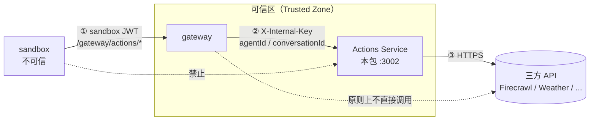

# Actions Service

Actions Service 是 Agent Runtime 的三方 API 集成服务。它运行在可信区内，统一持有三方 API Key，并只接受 gateway 通过内部密钥发起的调用。

## 在系统中的位置

Agent Runtime 的安全边界原则是：sandbox 不可信，所有外部能力必须经过 gateway。但如果把每一类三方 API 集成都写进 gateway，gateway 会不断膨胀，且三方 API Key 会和 gateway 自身凭证（`JWT_SECRET`、`LLM_API_KEY`）混在一起。

Actions Service 解决这个问题：它专门负责三方 API 集成，gateway 只保留稳定的代理路由。新增 action 时，通常只需要改 Actions Service，sandbox 和 gateway 的核心逻辑不需要变化。



完整架构见 [ARCHITECTURE.md](../../ARCHITECTURE.md)。

## 核心职责

1. **注册 action schema**
   - 对外提供 action 名称、描述和 input schema
   - gateway 通过 `/actions/list` 转发给 sandbox/agent-sdk

2. **执行三方 API 调用**
   - 根据 action 名称路由到对应实现
   - 使用服务端持有的三方 API Key 调用外部服务
   - 统一返回结果或错误 envelope

3. **保护三方凭证**
   - 三方 API Key 只存在 Actions Service 环境变量中
   - sandbox 不能直接访问 Actions Service
   - gateway 通过 `X-Internal-Key` 调用本服务

## 快速启动

```bash
# 在 monorepo 根目录运行
pnpm install
INTERNAL_API_KEY=dev-key FIRECRAWL_API_KEY=fc-xxx pnpm --filter @aaas/actions dev
```

服务默认监听 `http://localhost:3002`。

本地完整链路还需要：

- gateway 使用相同的 `INTERNAL_API_KEY`
- gateway 的 `ACTIONS_SERVICE_URL` 指向本服务，默认 `http://localhost:3002`

## 环境变量

| 变量 | 必填 | 默认值 | 说明 |
|------|------|--------|------|
| `INTERNAL_API_KEY` | 是 | — | 与 gateway 共享的内部密钥，用于校验 `X-Internal-Key` header |
| `FIRECRAWL_API_KEY` | 仅 `search_web` 需要 | — | Firecrawl API Key，用于网页搜索 action |
| `PORT` | 否 | `3002` | HTTP 服务监听端口 |

未来新增 action 时，可以按需增加新的三方 API Key，例如 `WEATHER_API_KEY`。这类变量属于 Actions Service 的 per-action 配置，不应写入 `AGENTS.md` 的平台级关键变量清单。

## API

所有请求都必须携带：

```http
X-Internal-Key: <INTERNAL_API_KEY>
```

该 header 由 gateway 附加。sandbox 不直接调用以下端点。

### `GET /actions/list`

返回已注册 action 的 schema，供 agent-sdk 在 session 初始化时拉取（经 gateway `/gateway/actions/list` 转发）。

```bash
curl http://localhost:3002/actions/list \
  -H "X-Internal-Key: dev-key"
```

### `POST /actions/invoke`

执行指定 action。请求体中的 `agentId` 和 `conversationId` 由 gateway 增补。

```bash
curl -X POST http://localhost:3002/actions/invoke \
  -H "Content-Type: application/json" \
  -H "X-Internal-Key: dev-key" \
  -d '{"action":"search_web","input":{"query":"AI news"},"agentId":"a1","conversationId":"c1"}'
```

## 错误码

| code | HTTP | retryable | 场景 |
|------|------|-----------|------|
| `action_not_found` | 400 | false | action 名称未注册 |
| `action_input_invalid` | 400 | false | 缺少 required 字段或 input 不合法 |
| `action_execution_failed` | 502 | true | 三方 API 返回错误 |
| `action_timeout` | 504 | true | 三方 API 超时（默认 25 秒） |
| `unauthorized` | 401 | false | `X-Internal-Key` 缺失或错误 |

## 已有 Actions

| Action | 说明 | 所需环境变量 |
|--------|------|--------------|
| `search_web` | 使用 Firecrawl 搜索网页，返回 title/url/description | `FIRECRAWL_API_KEY` |
| `get_weather` | 获取指定地点天气；当前为 stub，待接入真实 provider | 未来接入时使用 `WEATHER_API_KEY` |

## 新增 Action

1. 在 `src/actions/` 新建文件，实现 `ActionDefinition` 接口：

```typescript
// src/actions/my-action.ts
import type { ActionDefinition } from '../types.js'

export const myAction: ActionDefinition = {
  name: 'my_action',
  description: '做某件事',
  inputSchema: {
    type: 'object',
    properties: {
      param: { type: 'string', description: '参数说明' },
    },
    required: ['param'],
  },
  async execute(input, _context) {
    const { param } = input as { param: string }
    return { result: param }
  },
}
```

2. 在 `src/registry.ts` 注册：

```typescript
import { myAction } from './actions/my-action.js'

export const registry = new Map<string, ActionDefinition>([
  // ...
  ['my_action', myAction],
])
```

3. 在 Actions Service 的环境变量中添加对应三方 API Key，部署服务。gateway 核心代码不需要变化。

## 本地开发

```bash
# 在 monorepo 根目录运行
pnpm --filter @aaas/actions dev

# 单元测试（三方 API 已 mock）
pnpm --filter @aaas/actions test

# 类型检查 / 编译
pnpm --filter @aaas/actions build
```

完整本地 e2e 步骤见 [docs/LOCAL-DEV.md](../../docs/LOCAL-DEV.md)。
