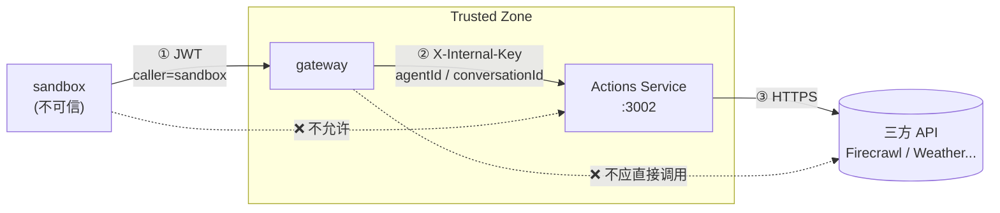

# Actions Service

## 在系统中的位置

z-mono 的安全边界原则：sandbox 不可信，所有外部访问必须经过 gateway。但如果把每一类三方 API 集成都写进 gateway，gateway 会无限膨胀，且三方 API Key 会和 gateway 自身凭证（JWT_SECRET、LLM_API_KEY）混在一起。

Actions Service 解决这个问题：它是 Trusted Zone 内部的独立服务，专门持有三方 API Key，暴露统一的 `invoke` 接口供 gateway 转发。**Gateway 只有两条永不改变的通用路由；新增三方 API 集成只需部署 Actions Service，gateway 代码不动。**



完整架构见 [ARCHITECTURE.md](../../ARCHITECTURE.md)。

---

## 快速启动

```bash
npm install
ACTIONS_INTERNAL_KEY=dev-key FIRECRAWL_API_KEY=fc-xxx npm run dev
```

服务默认监听 `http://localhost:3002`。

## 环境变量

| 变量 | 必填 | 说明 |
|------|------|------|
| `ACTIONS_INTERNAL_KEY` | 是 | 与 gateway 共享的密钥，验证 `X-Internal-Key` header |
| `FIRECRAWL_API_KEY` | 是（search_web） | [Firecrawl](https://www.firecrawl.dev/app/api-keys) API Key |
| `PORT` | 否 | 监听端口，默认 `3002` |

## API

所有请求必须携带 `X-Internal-Key: <ACTIONS_INTERNAL_KEY>` header，否则返回 `401`。该 header 由 gateway 附加，sandbox 端不直接调用这两个端点。

### `GET /actions/list`

返回所有已注册 action 的 schema，供 agent-sdk 在 session 初始化时拉取（通过 gateway `/gateway/actions/list` 转发）。

```bash
curl http://localhost:3002/actions/list -H "X-Internal-Key: dev-key"
```

### `POST /actions/invoke`

执行一个 action。请求体由 gateway 增补了 `agentId` 和 `conversationId`。

```bash
curl -X POST http://localhost:3002/actions/invoke \
  -H "Content-Type: application/json" \
  -H "X-Internal-Key: dev-key" \
  -d '{"action":"search_web","input":{"query":"AI news"},"agentId":"a1","conversationId":"c1"}'
```

**错误码：**

| code | HTTP | retryable | 场景 |
|------|------|-----------|------|
| `action_not_found` | 400 | false | action 名称未注册 |
| `action_input_invalid` | 400 | false | 缺少 required 字段 |
| `action_execution_failed` | 502 | true | 三方 API 返回错误 |
| `action_timeout` | 504 | true | 三方 API 超时（25s） |
| `unauthorized` | 401 | false | X-Internal-Key 缺失或错误 |

## 已有 Actions

| Action | 说明 | 所需环境变量 |
|--------|------|-------------|
| `search_web` | 用 Firecrawl 搜索网页，返回 title/url/description | `FIRECRAWL_API_KEY` |
| `get_weather` | 获取指定地点天气（stub，待实现） | `WEATHER_API_KEY` |

## 新增 Action

1. 在 `src/actions/` 新建文件，实现 `ActionDefinition` 接口：

```typescript
// src/actions/my-action.ts
import type { ActionDefinition } from '../types.js'

export const myAction: ActionDefinition = {
  name: 'my_action',
  description: '做某件事',
  inputSchema: {
    type: 'object',
    properties: {
      param: { type: 'string', description: '参数说明' },
    },
    required: ['param'],
  },
  async execute(input, _context) {
    const { param } = input as { param: string }
    return { result: param }
  },
}
```

2. 在 `src/registry.ts` 加一行：

```typescript
import { myAction } from './actions/my-action.js'

export const registry = new Map<string, ActionDefinition>([
  // ...
  ['my_action', myAction],
])
```

3. 在 Actions Service 的环境变量中添加三方 API Key，部署。Gateway 代码不动。

## 测试

```bash
npm test       # 单元测试（三方 API 已 mock）
npm run build  # TypeScript 类型检查 + 编译
```
