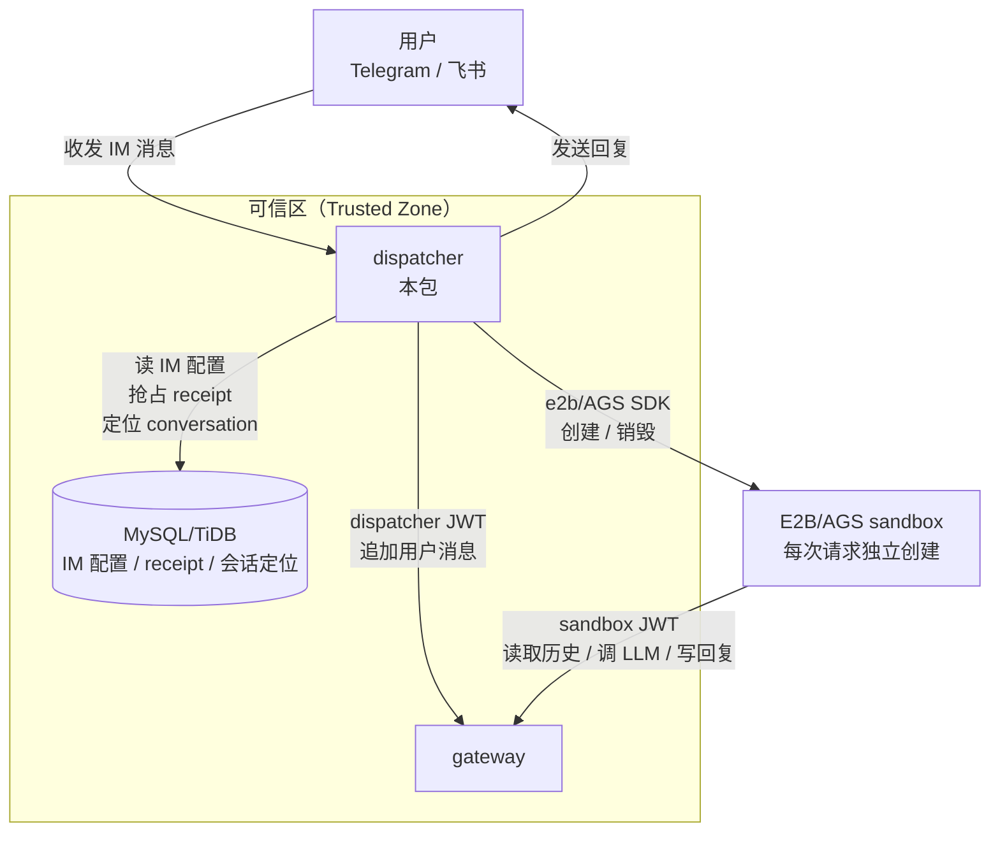

# Dispatcher

Dispatcher 是 Agent Runtime 的 IM 接入与 sandbox 编排层，负责管理已启用的 IM bot（Telegram、飞书等）、把用户消息转换为 agent 请求，并将 agent 回复发回给用户。

## 在系统中的位置



Dispatcher 位于链路最前端，是 IM 平台和 Agent Runtime 后端之间的桥梁。它不直接调用 LLM，也不直接写入完整对话内容；对话历史由 gateway 管理。Dispatcher 只直接维护 IM 配置、消息 receipt/lease、会话定位和本地 `lastMessageId` 缓存等调度元数据。

## 核心职责

### 1. Bot 注册表与热加载（`bot-registry`）

定期扫描数据库中 active 的 `im_configs`，为每个配置启动或停止对应的 bot runner。新增、停用或修改 bot 配置不需要重启 dispatcher 进程。

### 2. IM 消息接入与规范化

将各平台的原始事件（Telegram Update、飞书 IM 事件）统一规范化为内部 `NormalizedMessage` 结构，屏蔽平台差异。飞书群聊场景下会过滤掉未 @ 机器人的消息。

### 3. 幂等消息处理（`im-message-tracker`）

通过 `im_message_receipts` 表对每条 IM 消息做分布式抢占（claim）：

- 多个 dispatcher 实例并发收到同一条消息时，只有第一个成功 `INSERT` 的实例会处理；
- receipt 使用 lease 机制，实例崩溃后其他实例可在 lease 过期后重新认领，避免消息永久丢失；
- 当前高可用恢复循环仍属于 MVP 后续完善项。

### 4. 会话管理（`conversation`）

以 `(imConfigId, chatId, topicId)` 为唯一键维护 conversation 记录，并在内存中缓存每个 conversation 的 `lastMessageId`，用于调用 gateway 写消息时的乐观并发控制。

### 5. Sandbox 编排（`sandbox`）

每次处理请求时按需创建一个新的 E2B/AGS sandbox，在 sandbox 内启动 agent 进程，通过 HTTP `/chat` 获取回复，完成后销毁 sandbox。每请求一个 sandbox 的设计简化了生命周期管理，但会带来冷启动延迟。

### 6. JWT 签发与传递

Dispatcher 为每次请求签发两种 JWT：

- `dispatcherToken`：用于 dispatcher 向 gateway 写入用户消息，`caller=dispatcher`，TTL 短；
- `sandboxToken`：注入 sandbox 环境变量，agent 用它访问 gateway，`caller=sandbox`，作用域限制在当前 conversation。

## 关键流程

```text
启动 / 轮询 bot registry
  → 根据 active im_configs 启停 provider runner
  → runner 收到 IM 消息
  → claimMessage 抢占消息              # 幂等保证，多副本安全
  → 向 gateway 追加用户消息             # 写入历史，供 agent 读取
  → 发送“正在输入”提示到 IM             # 提升用户体验
  → 创建 sandbox → 启动 agent → /chat   # 调用 agent
  → 将 agent 回复发送到 IM              # 回复用户
  → 标记 receipt 为 done                # 完成处理
  → 异步同步 lastMessageId              # 更新本地缓存
```

## 环境变量

| 变量 | 必填 | 默认值 | 说明 |
|------|------|--------|------|
| `DATABASE_URL` | 是 | — | MySQL/TiDB 连接串 |
| `JWT_SECRET` | 是 | — | 签发 dispatcher/sandbox JWT 的密钥，需与 gateway 一致 |
| `BOT_TOKEN_ENC_KEY` | 是 | — | IM 凭证加密密钥，用于解密 `im_configs.credentials_enc` |
| `GATEWAY_URL` | 是 | — | gateway 公网地址，注入 sandbox 供 agent 使用，不能是 localhost |
| `GATEWAY_LOCAL_URL` | 否 | `http://localhost:3001` | dispatcher 本地访问 gateway 的地址，避免绕公网隧道 |
| `E2B_API_KEY` | 是 | — | E2B/AGS API Key |
| `E2B_DOMAIN` | 否 | e2b 默认域名 | 自定义 sandbox 后端域名；腾讯云 AGS 使用 `ap-beijing.tencentags.com` |
| `POD_NAME` | 否 | 自动生成 | 实例唯一标识，用于 receipt lease 归属追踪 |

Telegram bot token / 飞书凭证不直接从环境变量读取；它们以加密形式存储在 `im_configs.credentials_enc` 中，由 `BOT_TOKEN_ENC_KEY` 解密。

## 本地开发

```bash
# 在 monorepo 根目录运行
pnpm --filter @aaas/dispatcher dev

# 单元测试
pnpm --filter @aaas/dispatcher test

# DB-backed 集成测试
pnpm --filter @aaas/dispatcher test:integration
```

完整本地 e2e 步骤见 [docs/LOCAL-DEV.md](../../docs/LOCAL-DEV.md)。
