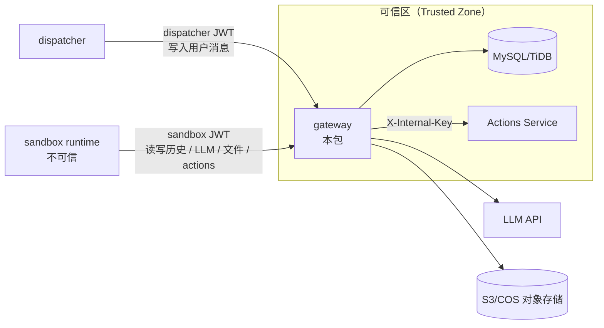

# Gateway

Gateway 是 Agent Runtime 的可信后端入口，负责会话历史、LLM 代理、sandbox 文件存储访问，以及 sandbox 到 Actions Service 的代理。除 `/health` 外，所有接口都需要 JWT 鉴权。

## 在系统中的位置



Gateway 是 sandbox 能访问的平台能力入口。sandbox 不直接访问数据库、LLM Provider、对象存储密钥或 Actions Service。

## 核心职责

1. **会话历史读写**
   - 从 MySQL/TiDB 读取 conversation 历史
   - 追加 `im` 或 `sandbox` 来源消息
   - 使用 `expected_last_message_id` 做乐观并发控制

2. **LLM 代理**
   - 校验请求中的模型是否在 `ALLOWED_MODELS` 白名单内
   - 使用平台侧 `LLM_API_KEY` 调用上游 LLM
   - sandbox 不接触 LLM Key

3. **文件存储代理**
   - 在 S3/COS 配置齐全时启用 storage 路由
   - 为 sandbox 生成受作用域限制的预签名上传/下载 URL
   - 文件路径限制在 `shared/*` 或 `conversation/*`

4. **Actions Service 代理**
   - sandbox 通过 `/gateway/actions/*` 调用工具
   - gateway 使用 `X-Internal-Key` 调用 Actions Service
   - gateway 会在 invoke 时注入 `agentId` 和 `conversationId`

5. **统一鉴权与边界控制**
   - 所有非健康检查请求都验证 JWT
   - 根据 `caller` claim 限制消息来源和可访问路由

## 环境变量

| 变量 | 必填 | 默认值 | 说明 |
|------|------|--------|------|
| `DATABASE_URL` | 是 | — | MySQL/TiDB 连接串 |
| `JWT_SECRET` | 是 | — | 验证 JWT 的共享密钥，需与 dispatcher 一致，至少 32 字符 |
| `LLM_API_KEY` | 是 | — | 平台侧 LLM Provider API Key |
| `PORT` | 否 | `3001` | HTTP 服务监听端口 |
| `LLM_BASE_URL` | 否 | `https://api.z.ai/api/coding/paas/v4/chat/completions` | LLM Provider endpoint |
| `ALLOWED_MODELS` | 否 | `glm-5.1` | 逗号分隔的模型白名单，如 `glm-5.1,glm-4` |
| `S3_ENDPOINT` | 否 | — | S3 兼容 endpoint；S3 变量齐全时启用 storage 路由 |
| `S3_BUCKET` | 否 | — | 对象存储 bucket |
| `S3_ACCESS_KEY` | 否 | — | 对象存储 access key |
| `S3_SECRET_KEY` | 否 | — | 对象存储 secret key |
| `S3_REGION` | 否 | `us-east-1` | 对象存储 region |
| `ACTIONS_SERVICE_URL` | 否 | `http://localhost:3002` | Actions Service 内部地址 |
| `INTERNAL_API_KEY` | 是 | — | gateway 调用 Actions Service 时发送的 `X-Internal-Key`，不得暴露给 sandbox |

示例值见仓库根目录 `.env.example`。

## API

除 `/health` 外，所有接口都需要：

```http
Authorization: Bearer <JWT>
```

### 健康检查

| 方法 | 路径 | 鉴权 | 说明 |
|------|------|------|------|
| GET | `/health` | 不需要 | 存活检查，返回 `{ ok: true }` |

### 消息历史：`/gateway/messages`

| 方法 | 路径 | 鉴权 | 说明 |
|------|------|------|------|
| POST | `/gateway/messages/load` | 需要 | 读取 JWT 中 conversation 的历史；可传 `after_message_id` 只读取增量消息 |
| POST | `/gateway/messages/append` | 需要 | 追加一条或多条消息；必须提供 `expected_last_message_id`，冲突时返回 `409 stale_write` |

conversation 由 JWT payload 中的 `conversation_id` 决定，不从 URL 或请求体信任外部传入。

### LLM：`/gateway/llm`

| 方法 | 路径 | 鉴权 | 说明 |
|------|------|------|------|
| POST | `/gateway/llm` | 需要 | 代理 chat completion 请求到 LLM Provider；只允许白名单模型 |

### 文件存储：`/gateway/storage`

仅当 `S3_ENDPOINT`、`S3_BUCKET`、`S3_ACCESS_KEY`、`S3_SECRET_KEY` 配置齐全时启用。

| 方法 | 路径 | 鉴权 | 说明 |
|------|------|------|------|
| POST | `/gateway/storage/presign` | 需要 | 为 `shared/*` 或 `conversation/*` 路径生成受作用域限制的预签名上传/下载 URL |
| POST | `/gateway/storage/list` | 需要 | 列出调用方作用域内的 shared 或 conversation 文件 |

### Actions：`/gateway/actions`

仅允许 sandbox JWT 调用。gateway 会转发到 Actions Service，并附加 `X-Internal-Key`。

| 方法 | 路径 | 鉴权 | 说明 |
|------|------|------|------|
| GET | `/gateway/actions/list` | 仅 sandbox JWT | 获取可用 action schema |
| POST | `/gateway/actions/invoke` | 仅 sandbox JWT | 调用指定 action，并传入 input payload |

## 本地开发

```bash
# 在 monorepo 根目录运行
pnpm --filter @aaas/gateway dev

# 单元测试
pnpm --filter @aaas/gateway test

# DB-backed 集成测试
pnpm --filter @aaas/gateway test:integration
```

完整本地 e2e 步骤见 [docs/LOCAL-DEV.md](../../docs/LOCAL-DEV.md)。
